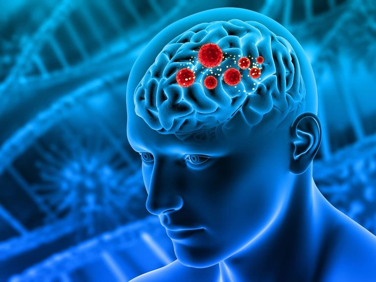
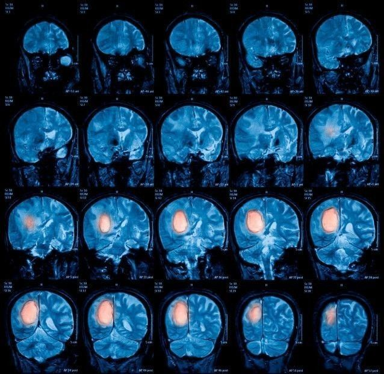

# Brain Tumor Detection using Python and Scikit-Learn

## Introduction

The project is an exploration of brain tumor detection using Python and machine learning techniques. The project leverages **Scikit-Learn, OpenCV, NumPy, and Matplotlib** to analyze MRI scans and predict the presence of brain tumors.

## Significance

Brain tumor detection is a critical challenge in biomedical data science. Early and accurate detection of brain tumors significantly improves patient outcomes. This project demonstrates how machine learning models, specifically **Support Vector Machines (SVM)** and **Logistic Regression**, can assist in medical image analysis.

## Requirements

To run this project, ensure you have the following dependencies installed:

- Python: [Download Python](https://www.python.org/downloads/)
- Scikit-Learn: `pip install sklearn`
- OpenCV: `pip install opencv-python`
- NumPy: `pip install numpy`
- Matplotlib: `pip install matplotlib`

## Download and Setup

1. **Clone the repository** from GitHub.
2. **Install the dependencies** listed above.
3. **Open the project in Jupyter Notebook** or any preferred Python IDE.
4. **Run the cells sequentially** to load the dataset, preprocess images, and train the model.

## Dataset

The dataset can be found in the repository or downloaded from [Kaggle](https://www.kaggle.com/sartajbhuvaji/brain-tumor-classification-mri).

## Steps Involved

### 1. Load Dependencies

Import necessary libraries and set up the environment.

### 2. Load and Preprocess Data

- Read MRI scans and convert them into grayscale.
- Apply image processing techniques to enhance tumor visibility.

### 3. Data Analysis

Explore the dataset using visualizations and statistical analysis.

### 4. Data Visualization

Visualize MRI scans and processed images to understand the dataset better.

### 5. Train-Test Split

Split the dataset into training and testing sets for model evaluation.

### 6. Feature Scaling

Apply **Min-Max Scaling** to normalize pixel values.

### 7. Model Training

Train models using **SVM** and **Logistic Regression** to classify images.

### 8. Model Evaluation

Compare model performance based on accuracy, precision, and recall.

### 9. Prediction

Use the trained models to predict unseen MRI scans.

### 10. Testing on Sample Data

Evaluate model predictions on test MRI scans.

## Results and Observations

The **SVM model** outperformed **Logistic Regression** in accuracy and generalization, making it the preferred model for this task.

## Conclusion

This project highlights the application of machine learning in medical image analysis. While machine learning can aid in diagnosis, it should complement medical professionals' expertise rather than replace it.

---

### Future Enhancements

- Implement **deep learning** using Convolutional Neural Networks (CNNs).
- Integrate **real-time prediction** for MRI scans.
- Improve dataset quality by incorporating more diverse MRI images.
